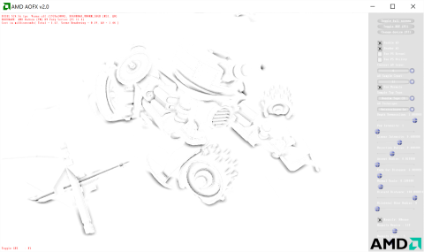

# AMD AOFX

The AOFX library provides a scalable and GCN-optimized ambient occlusion (AO) solution. Currently, the library supports the High Definition Ambient Occlusion (HDAO) kernel and implements a variety of options:
* Pixel shader and compute shader implementations
* Multi-layer approach that provides fine details and smooth, alias-free global ambient occlusion
* Takes depth buffer or depth+normal buffers as input
* Supports input de-interleaving and downscaling
* Fast, separable, depth-guided bilateral blur

The AOFX library can also serve as a sandbox for experiments with other AO techniques

### Prerequisites
* AMD Radeon&trade; GCN-based GPU (HD 7000 series or newer)
* 64-bit Windows&reg; 7 (SP1 with the [Platform Update](https://msdn.microsoft.com/en-us/library/windows/desktop/jj863687.aspx)), Windows&reg; 8.1, or Windows&reg; 10
* Visual Studio&reg; 2012, Visual Studio&reg; 2013, or Visual Studio&reg; 2015

### Getting started
* Visual Studio solutions for VS2012, VS2013, and VS2015 can be found in the `amd_aofx_sample\build` directory.
* There are also solutions for just the core library in the `amd_aofx\build` directory.
* Additional documentation is available in the `amd_aofx\doc` directory.

### Premake
The Visual Studio solutions and projects in this repo were generated with Premake. If you need to regenerate the Visual Studio files, double-click on `gpuopen_aofx_update_vs_files.bat` in the `premake` directory.

This version of Premake has been modified from the stock version to use the property sheet technique for the Windows SDK from this [Visual C++ Team blog post](http://blogs.msdn.com/b/vcblog/archive/2012/11/23/using-the-windows-8-sdk-with-visual-studio-2010-configuring-multiple-projects.aspx). The technique was originally described for using the Windows 8.0 SDK with Visual Studio 2010, but it applies more generally to using newer versions of the Windows SDK with older versions of Visual Studio.

The default SDK for a particular version of Visual Studio (for 2012 or higher) is installed as part of Visual Studio installation. This default (Windows 8.0 SDK for Visual Studio 2012 and Windows 8.1 SDK for Visual Studio 2013) will be used if newer SDKs do not exist on the user's machine. However, the projects generated with this version of Premake will use the next higher SDK (Windows 8.1 SDK for Visual Studio 2012 and Windows 10 SDK with Visual Studio 2013), if the newer SDKs exist on the user's machine.

For Visual Studio 2015, this version of Premake adds the `WindowsTargetPlatformVersion` element to the project file to specify which version of the Windows SDK will be used. To change `WindowsTargetPlatformVersion` for Visual Studio 2015, change the value for `_AMD_WIN_SDK_VERSION` in `premake\amd_premake_util.lua` and regenerate the Visual Studio files.

### Third-Party Software
* DXUT is distributed under the terms of the MIT License. See `dxut\MIT.txt`.
* Premake is distributed under the terms of the BSD License. See `premake\LICENSE.txt`.

DXUT is only used by the sample, not the core library. Only first-party software (specifically `ags_lib`, `amd_aofx`, and `amd_lib`) is needed to build the AOFX library.

### Attribution
* AMD, the AMD Arrow logo, Radeon, and combinations thereof are either registered trademarks or trademarks of Advanced Micro Devices, Inc. in the United States and/or other countries.
* Microsoft, DirectX, Visual Studio, and Windows are either registered trademarks or trademarks of Microsoft Corporation in the United States and/or other countries.
